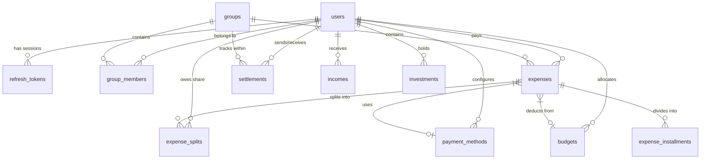
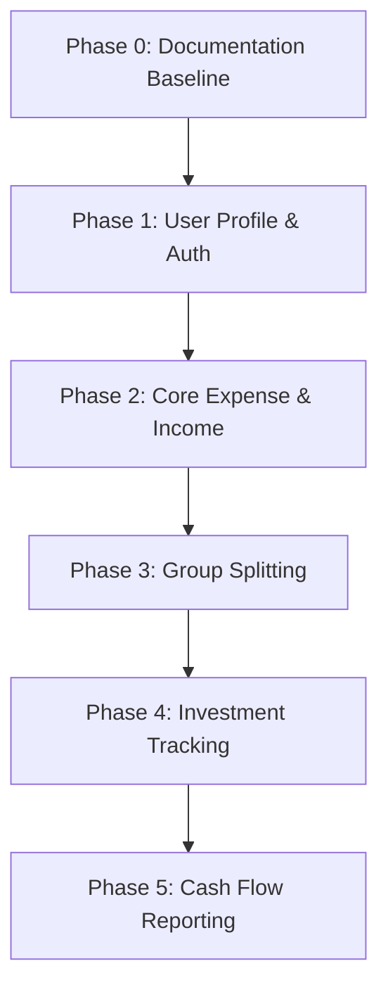

# Socky Backend Implementation Roadmap

This document outlines the roadmap and architecture baseline for the Socky backend application.

Specific, detailed implementation designs for each phase/feature are stored in sub-documents within the `docs/plans/` directory.

---

## 1. Database Schema & Architecture Baseline

The complete database schema integrates user settings, payment methods (for credit card cycles), budget envelopes, expense installments, splitting groups, and investments.

For the user state machine and transition logic details, see [docs/reference/user_state_machine.md](file:///home/schneider/Documents/socky-be/docs/reference/user_state_machine.md).

---

## 2. Phased Roadmap

### Phase 0: Source Code Documentation Baseline

- **Goal**: Review all existing modules and write comprehensive doc comments (`///` and `//!`) so that `cargo doc` compiles clean, high-quality documentation.
- **Details**: See [docs/plans/phase_0_doc_baseline.md](file:///home/schneider/Documents/socky-be/docs/plans/phase_0_doc_baseline.md).

### Phase 1: User Profile Extensions & Authorization Logic

- **Goal**: Add missing user profile columns (`username`, `full_name`), update the user entity, and implement the path-based authorization bypass for `Disabled` users.
- **Details**: See [docs/plans/phase_1_user_auth.md](file:///home/schneider/Documents/socky-be/docs/plans/phase_1_user_auth.md).

### Phase 2: Core Expense & Income Tables

- **Goal**: Implement personal transaction tracking (Debit vs. Credit Card cycles with installment dates) and Income tracking (without splits).
- **Details**: See [docs/plans/phase_2_core_finance.md](file:///home/schneider/Documents/socky-be/docs/plans/phase_2_core_finance.md).

### Phase 3: Group Splitting & Debt Tracking

- **Goal**: Implement Splitwise-like features (Groups, Group Members, Expense Splits, and Debt/Settlement logic).
- **Details**: See `docs/plans/phase_3_splitting.md` (to be created).

### Phase 4: Investment Tracking

- **Goal**: Implement simple investment entries (buy date, due dates, amounts).
- **Details**: See `docs/plans/phase_4_investments.md` (to be created).

### Phase 5: Cash Flow Reporting

- **Goal**: Implement monthly aggregation reports (Income vs. Expenses grouped by budget envelope/categories).
- **Details**: See `docs/plans/phase_5_reporting.md` (to be created).
