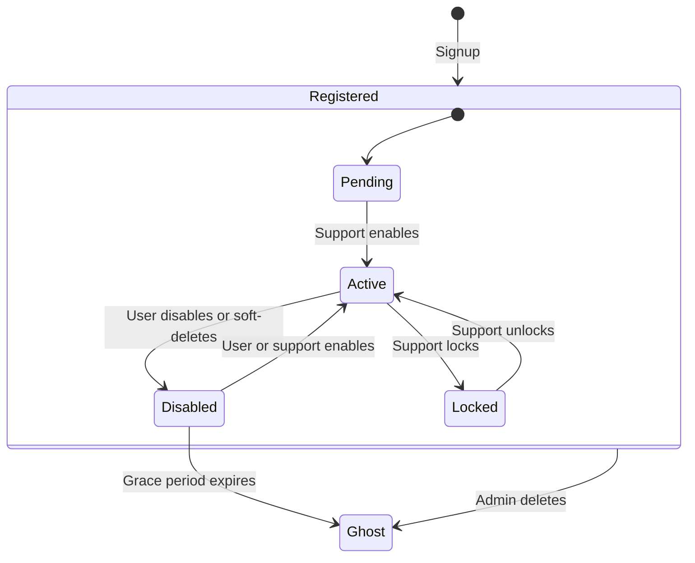

# User State Machine & Lifecycle Specifications

This document defines the states, transitions, and API authorization rules for the user account lifecycle in the Socky application.

---

## 1. State Diagram



> **IMPORTANT**
>
> User self-deletion initiates a **grace period** by placing the account in the **Disabled** state and setting `deleted_at`. Admin deletion is **final** with no recovery. See [Ghost User Strategy](./ghost_user_strategy.md) for details on what happens to user data on final deletion.

---

## 2. State Descriptions

1. **Pending**: Initial state after signup or invite. The user has a record but has not been verified or activated.
2. **Active**: Normal operating state. Full access to all features.
3. **Disabled**: User has temporarily self-deactivated or initiated a soft-delete (grace period). Can log in with limited access to view their profile, delete their account permanently, or self-enable to restore full access.
4. **Locked**: Administrative/security lock. Cannot perform actions or self-enable. Must be unlocked by Support/Admin.
5. **Ghost**: Terminal state. The user's credentials have been anonymized and the account is permanently deactivated. The row remains as a foreign key target for financial records. See [Ghost User Strategy](file:///home/schneider/Documents/socky-be/docs/reference/ghost_user_strategy.md).

---

## 3. API Authorization Matrix

When a user is authenticated, their token claims contain their `status`. The `auth_middleware` enforces rules according to this matrix:

| Endpoint Group | Example Endpoints | Pending | Active | Disabled | Locked |
| :--- | :--- | :---: | :---: | :---: | :---: |
| **Public Auth** | `/api/auth/signup`, `/api/auth/login`, `/api/auth/refresh` | Blocked* | Allowed | Allowed | Blocked* |
| **Authenticated Auth** | `/api/auth/logout`, `/api/auth/logout-all` | Blocked | Allowed | Allowed | Blocked |
| **Self-Service (Any Status)** | `GET /api/user/me`, `DELETE /api/user/me`, `POST /api/user/me/enable` | Blocked | Allowed | Allowed | Blocked |
| **Self-Service (Active Only)** | `PATCH /api/user/me`, `PATCH /api/user/me/username` | Blocked | Allowed | Blocked | Blocked |
| **Social Discovery** | `GET /api/profile/*` | Blocked | Allowed | Blocked | Blocked |
| **Administrative** | `GET /api/user`, `DELETE /api/user/{id}`, `POST /api/user/{id}/lock` | Blocked | Allowed* | Blocked | Blocked |
| **Core App Operations** | `/api/expense/*`, `/api/group/*`, `/api/settlement/*` | Blocked | Allowed | Blocked | Blocked |

> **NOTE**
>
> - Administrative endpoints also require specific `UserRole` claims (Support or Admin) in addition to the `Active` status.
> - `Pending` and `Locked` users are blocked at the login stage (`403 Forbidden`) and cannot obtain access tokens. `Disabled` users can log in, but are severely restricted by the `require_active` middleware to only access the "Any Status" endpoints.
> - Ghost users cannot authenticate at all (credentials are `NULL`), so they never reach the middleware. Admin endpoints (`/api/user/*`) are governed by **role-based** access (Support/Admin), not by this status matrix.

---

## 4. Technical Implementation Design

### JWT Access Token Claims

Extend `AccessClaims` in [token.rs](file:///home/schneider/Documents/socky-be/src/utils/token.rs):

```rust
#[derive(Debug, Serialize, Deserialize, Clone)]
pub struct AccessClaims {
    jti: Uuid,
    sub: i64,
    role: UserRole,
    status: UserStatus, // New field
    exp: i64,
    iat: i64,
}
```

### Authentication Verification (`can_authenticate`)

In `src/model/user/entity.rs`, the `UserStatus::can_authenticate` method blocks invalid statuses at the authentication layer:

- If `status == UserStatus::Active | UserStatus::Disabled`: Allowed
- If `status == UserStatus::Pending | UserStatus::Locked`: Returns `UserStatusError` (`403 Forbidden`).

### Endpoints Protection via Middleware

We use robust Axum router composition in `src/app.rs`.

- Administrative operations and general app endpoints (like expenses and profiles) are protected by the `require_active_middleware`, which checks the JWT claims and rejects anyone who is not `UserStatus::Active`.
- A few specific self-service endpoints (`GET /api/user/me`, `DELETE /api/user/me`, and `POST /api/user/me/enable`) bypass this middleware, allowing Disabled users to view their deletion status, permanently delete, or re-enable their accounts.
