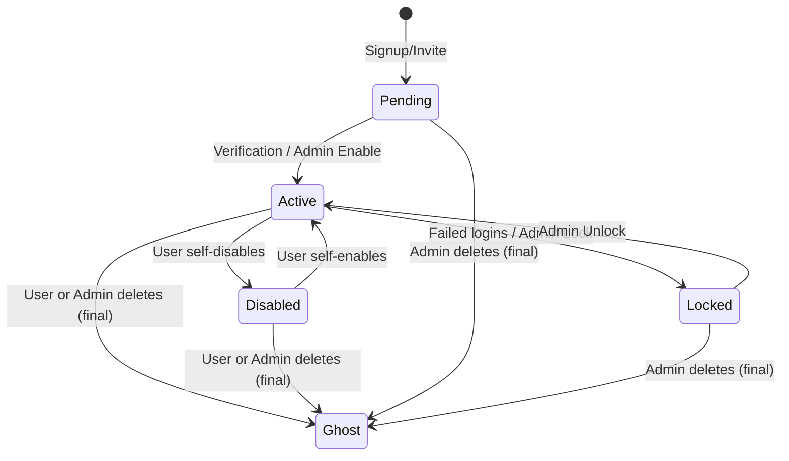

# User State Machine & Lifecycle Specifications

This document defines the states, transitions, and API authorization rules for the user account lifecycle in the Socky application.

---

## 1. State Diagram



> [!IMPORTANT]
> Deletion is **final** — there is no grace period or account recovery. Users who want a reversible option should use **Disable** instead. See [ghost_user_strategy.md](file:///home/schneider/Documents/socky-be/docs/reference/ghost_user_strategy.md) for details on what happens to user data on deletion.

---

## 2. State Descriptions

1. **Pending**: Initial state after signup or invite. The user has a record but has not been verified or activated.
2. **Active**: Normal operating state. Full access to all features.
3. **Disabled**: User has temporarily self-deactivated. Can log in with limited access and self-enable back to Active.
4. **Locked**: Administrative/security lock. Cannot perform actions or self-enable. Must be unlocked by Support/Admin.
5. **Ghost**: Terminal state. The user's credentials have been anonymized and the account is permanently deactivated. The row remains as a foreign key target for financial records. See [Ghost User Strategy](file:///home/schneider/Documents/socky-be/docs/reference/ghost_user_strategy.md).

---

## 3. API Authorization Matrix

When a user is authenticated, their token claims contain their `status`. The `auth_middleware` enforces rules according to this matrix:

| Endpoint Pattern | Pending | Active | Disabled | Locked |
| :--- | :---: | :---: | :---: | :---: |
| **Auth Operations** (`/api/auth/login`, `refresh`, `logout`, `logout-all`) | Allowed | Allowed | Allowed | Allowed |
| **Re-enable Account** (`POST /api/user/me/enable`) | Blocked | Allowed | Allowed | Blocked |
| **View Own Account** (`GET /api/user/me`) | Blocked | Allowed | Allowed | Allowed |
| **Delete Own Account** (`DELETE /api/user/me`) | Blocked | Allowed | Allowed | Allowed |
| **All Other App Operations** (Expenses, Incomes, Budgets, Groups, etc.) | Blocked | Allowed | Blocked | Blocked |

> [!NOTE]
> Ghost users cannot authenticate at all (credentials are `NULL`), so they never reach the middleware. Admin endpoints (`/api/user/*`) are governed by **role-based** access (Support/Admin), not by this status matrix.

---

## 4. Technical Implementation Design

### JWT Access Token Claims
Extend `AccessClaims` in [token.rs](file:///home/schneider/Documents/socky-be/src/utils/token.rs):
```rust
#[derive(Debug, Serialize, Deserialize, Clone)]
pub struct AccessClaims {
    jti: Uuid,
    sub: i64,
    role: UserRole,
    status: UserStatus, // New field
    exp: i64,
    iat: i64,
}
```

### Authentication Middleware Verification
In [auth_middleware](file:///home/schneider/Documents/socky-be/src/web/middleware/auth.rs), extract `status` from claims. If the status is not `Active`, match the request path and method:
- If `status == UserStatus::Disabled`:
  - Permit: `/api/user/me/enable`, `/api/user/me` (GET/DELETE), auth endpoints.
  - Reject all other requests with `403 Forbidden`.
- If `status == UserStatus::Pending`:
  - Reject all non-auth requests with `403 Forbidden`.
- If `status == UserStatus::Locked`:
  - Permit: `/api/user/me` (GET/DELETE).
  - Reject all other requests with `403 Forbidden`.
