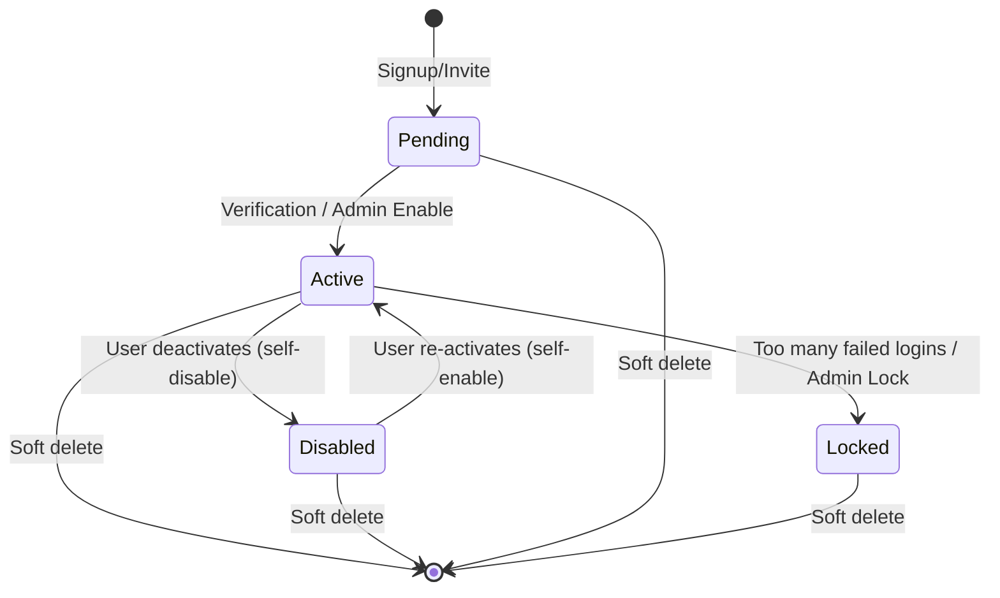

# User State Machine & Lifecycle Specifications

This document defines the states, transitions, and API authorization rules for the user account lifecycle in the Socky application.

---

## 1. State Diagram



---

## 2. State Descriptions

1. **Pending**: The initial state after signup or when invited to a group before activation. The user has an account but has not verified their email or has not been activated.
2. **Active**: The normal operating state. The user has full access to all features (expense tracking, groups, splitting, incomes, investments, etc.).
3. **Disabled**: The user has temporarily deactivated their own account. They can still log in to view their profile, but they cannot perform any transactional actions. They must be able to re-enable their account themselves.
4. **Locked**: Administrative/security lock (e.g. from suspicious activity, failed login attempts, or abuse). The user cannot perform any transactions or re-enable their own account. They must contact support.

---

## 3. API Authorization Matrix

When a user is authenticated, their token claims will contain their `status`. The `auth_middleware` will enforce rules according to this matrix:

| Endpoint Pattern | Pending | Active | Disabled | Locked |
| :--- | :---: | :---: | :---: | :---: |
| **Auth Operations** (`/api/auth/login`, `refresh`, `logout`, `logout-all`) | Allowed | Allowed | Allowed | Allowed |
| **Re-enable Account** (`POST /api/user/me/enable`) | Blocked | Allowed | Allowed | Blocked |
| **View Own Account** (`GET /api/user/me`) | Blocked | Allowed | Allowed | Allowed (for deletion/view only) |
| **All Other App Operations** (Expenses, Incomes, Budgets, Groups, Splitting, etc.) | Blocked | Allowed | Blocked | Blocked |

---

## 4. Technical Implementation Design

### JWT Access Token Claims
We will extend `AccessClaims` in [token.rs](file:///home/schneider/Documents/socky-be/src/utils/token.rs):
```rust
#[derive(Debug, Serialize, Deserialize, Clone)]
pub struct AccessClaims {
    jti: Uuid,
    sub: i64,
    role: UserRole,
    status: UserStatus, // New Field
    exp: i64,
    iat: i64,
}
```

### Authentication Middleware Verification
In [auth_middleware](file:///home/schneider/Documents/socky-be/src/web/middleware/auth.rs), we will extract the `status` from claims. If the status is not `Active`, we will match the request path and method:
- If `status == UserStatus::Disabled`:
  - Permit if path is `/api/user/me/enable`, `/api/user/me` (GET only), or auth endpoints.
  - Reject all other requests with a `403 Forbidden` (`UserDisabled` error code).
- If `status == UserStatus::Pending`:
  - Reject all requests with `403 Forbidden` (`UserPending` error code).
- If `status == UserStatus::Locked`:
  - Permit if path is `/api/user/me` (GET or DELETE only).
  - Reject all other requests with `403 Forbidden` (`UserLocked` error code).
